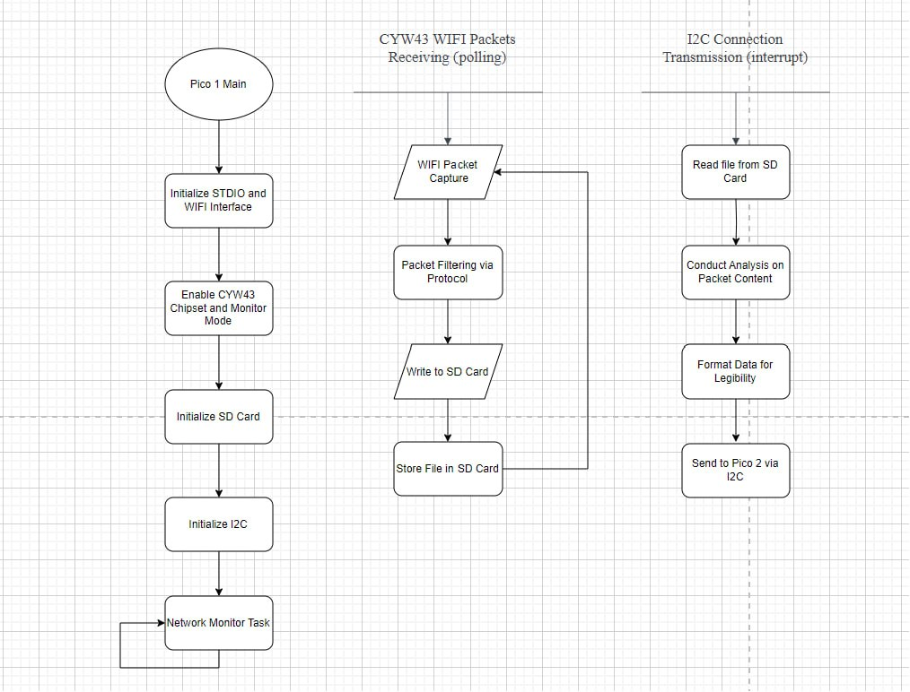
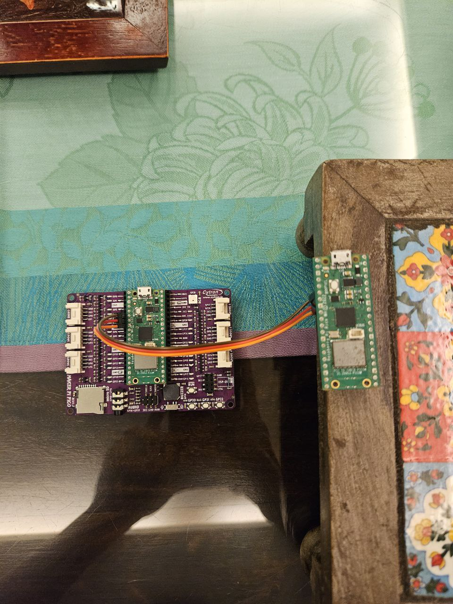

# INF2004 Project - WIFI Sniffing

## Block Diagram


## Flow Charts

### Pico 1



### Pico 2


## Functions

### Wifi Packet Sniffer
Using cyw43-driver firmware patch with nexmon, an access point can be configured to capture packets on a pico w for further analysis. 

### Network Analysis on ICMP Request, ICMP Reply, ARP and DNS
Pattern Threshold Flagging: Pico W receives packets and recognises a pattern, if the pattern is repeated a certain number of times, if can be flagged as an attack.
   
### Micro SD Card
File System: SD Card uses the FAT file system for file memory management and communicates using SPI 

### Telegram API
Master Pico W connects to Wi-Fi, interacts with the Telegram API for communication, and reads I2C data from the slave Pico W. The bot continuously checks for Telegram messages, processes commands like starting/stopping anomaly detection, and currently reports detected anomalies that the slave Pico W has been hardcoded to send.

## Set Up Guide

### Hardware Requirements

- 2x Raspberry Pi Pico W
- 1x Maker Pi Board
- 3x Male-to-Female cable (Plug into GPIO pins 4, 5 and ground for both picos)



### Build Nexmon

Unzip nexmon file into current directory
[nexmon zip](https://drive.google.com/file/d/1zPOxOzExa2OGGr4ASAb2gz_CPQqirKNu/view?usp=sharing)

### CMake Environment

- In pico-sniffer directory, edit line 19 on CMakeLists.txt
```
set(NEXMON_ROOT "path/to/nexmon_root")
```

### Pico SDK Environment

- Ensure development environment has been configured with Pico SDK
[Example configuration for MacOS](https://github.com/Bread7/Pico-SDK-Setup-MacOS)

### Build the file (1st Pico)

- Compile cmake using Pico SDK into UF2 file
- Main file will be `integrated_monitor.c` into `integrated_monitor.uf2`
- File can be found in the build/ folder
- Set Pi Pico in BOOTSEL mode and place UF2 file inside

### Set Up MicroPython Environment (2nd Pico)

- Follow this guide, [Thonny for Pi Pico](https://projects.raspberrypi.org/en/projects/getting-started-with-the-pico/2) to set up the environment
- Use Thonny to load MicroPython Firmware into Pi Pico W

### Change MicroPython Environment Variables

- In `settings.toml`, edit the `botToken` variable using your own botToken derived from Telegram Botfather
- In `settings.toml`, edit the `WIFI_SSID` and `WIFI_PASSWORD` variable using your own hotspot or nearby AP connections

### References for Project

[Nexmon firmware patching](https://github.com/seemoo-lab/nexmon)
[FatFS on SD Card using SPI](https://github.com/carlk3/no-OS-FatFS-SD-SPI-RPi-Pico)
[I2C slave](https://github.com/vmilea/pico_i2c_slave)
[Telegram bot](https://my.cytron.io/tutorial/using-raspberry-pi-pico-w-with-telegram-bot)

### References for MacOS patching
[No lfl on mac](https://stackoverflow.com/questions/21298097/library-not-found-for-lfl)
[Argp location mac](https://github.com/AltraMayor/f3/issues/42)
[Make target rule on a header file](https://stackoverflow.com/questions/13934841/make-no-rule-to-make-a-header-file)

### Contributors

- Beckham Lee
- Joseph Lim
- Nikhil Bartake
- Chen Xingxing
- Ong Zheng Jie